# From Linear Regression to a Neural Network: One Dataset, Six Steps

*Understand prediction, loss and learning—and see how the same ideas grow into a neural network.*

How do we get from fitting a straight line to training a neural network?

The connection becomes easier to see when we keep the problem fixed. We will create a small dataset, use linear regression to predict a numerical outcome, turn the same problem into a classification task, and gradually build a network that can learn a nonlinear relationship.

Along the way, three questions will guide us: **How does the model make a prediction? How do we measure its error? How do we use that error to improve it?** The mathematical answers will carry through even as we move from NumPy to scikit-learn and PyTorch.

The companion project contains seven Jupyter notebooks: one introduces the data, and six follow the steps below. This article develops the ideas and interprets the results; the notebooks let you implement them, inspect the plots and run your own experiments.

## First, create a problem we can understand

Imagine a dataset of 1,000 students. For each student, we observe study hours, denoted by sᵢ, and sleep hours, denoted by hᵢ. We generate an exam score from:

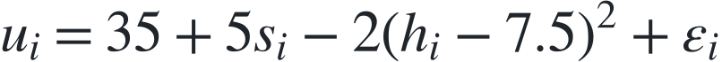

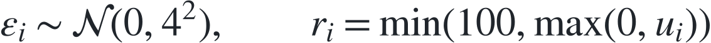

Here, rᵢ is the final score, clipped to the range 0–100. The noise term introduces variation that the two observed features cannot predict.

The formula contains a deliberate contrast. Study hours have a linear effect, while sleep has a quadratic effect with a peak at 7.5 hours. These are rules of our synthetic world, not empirical claims about students or sleep.

We also create a binary label:

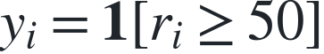

The indicator is 1 when the student passes and 0 otherwise. We now have two related tasks: **regression** predicts the score rᵢ; **classification** predicts the label yᵢ.

Because we created the data, we know the relationship the models are trying to approximate. The curved sleep effect will help us distinguish errors caused by imperfect training from errors caused by a model that is too restrictive.

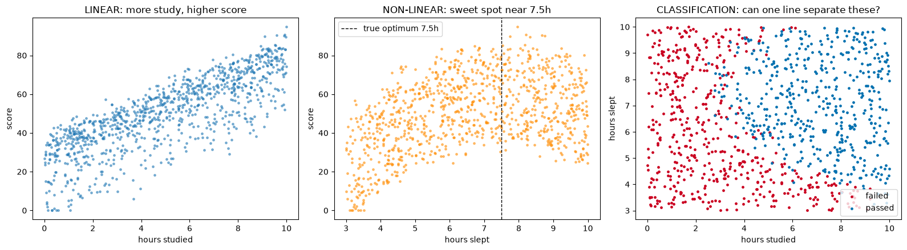

*Left: scores tend to rise with study hours. Middle: the sleep effect has a sweet spot. Right: the same observations become a pass/fail classification problem.*

We use 700 examples for training, 150 for validation and 150 for testing. Training data fits the parameters; validation data guides choices such as when to stop; test data measures performance on held-out examples.

Before training, each feature is standardised:

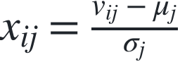

Here, vᵢⱼ is student i's original value for feature j, and μⱼ and σⱼ are computed on the **training set only**. We apply those same statistics to validation and test data. From this point on, xᵢ denotes the two standardised inputs.

## 1. Linear regression: prediction, loss and learning

### Prediction is a function with adjustable parameters

Our first model predicts a score from a weighted sum:

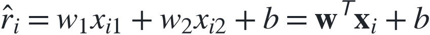

The weights determine how strongly each input affects the prediction. The bias b sets its baseline. Collectively, these are the model's parameters: θ = (w, b).

For all n training examples at once, the same expression becomes:

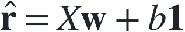

Each row of X contains one student's features. This matrix expression is the mathematical counterpart of the short NumPy prediction in the first notebook.

### A loss turns errors into an objective

We need a way to judge the parameters. The **mean squared error**, or MSE, averages the squared differences between predictions and observed scores:

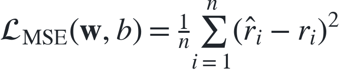

Squaring prevents positive and negative errors from cancelling and penalises large errors more strongly. A prediction that misses by 10 points contributes four times as much loss as one that misses by 5 points.

Training means searching for parameters that minimise this loss on the training set:

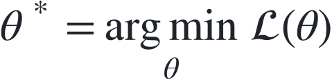

The loss is an optimisation objective. Generalisation is a separate question, which is why we evaluate the fitted model on held-out data.

### Gradient descent tells us how to change the parameters

The gradient describes how the loss changes as each parameter changes. Gradient descent moves in the opposite direction:

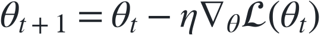

The learning rate η > 0 controls the size of each update. A sufficiently small step follows a local decrease in the loss; an overly large step can overshoot and make training diverge.

For our MSE objective, the derivatives are:

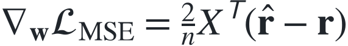

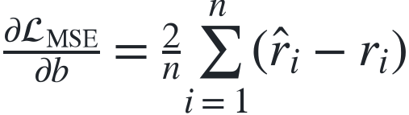

These formulas connect prediction errors to parameter updates. A weight's gradient combines the residual errors with the corresponding input feature; the bias gradient depends on the average residual. Repeated updates gradually improve the fit.

The first notebook implements these expressions directly and compares the result with a least-squares solution computed without iterative gradient updates. Their agreement checks that gradient descent has fitted the intended model. The learning-rate experiments make slow convergence and divergence visible.

On the held-out test set, the fitted model has **MSE 66.83**, corresponding to a root mean squared error of about **8.18 score points**, and **R² of 0.786**. R² compares squared prediction errors with a baseline that always predicts the test-set mean; here, the model reduces that total squared error by about 78.6%.

Yet the model still has a structural limitation. A weighted sum of the original study and sleep features cannot represent the quadratic sleep term. Standardisation changes their scale, but does not introduce a curve. Finding the best parameters within a model family does not make that family more expressive.

## 2. Logistic regression: from scores to probabilities

Now we predict whether the student passes. We keep the weighted sum, call it a **logit**, and pass it through the sigmoid function:

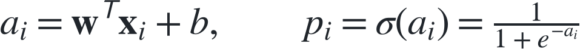

The output pᵢ lies between 0 and 1 and represents the model's estimated probability of passing. For a class prediction, we threshold that probability:

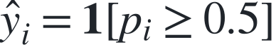

We also change the loss. **Binary cross-entropy** measures how well the probabilities agree with the observed labels:

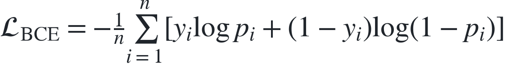

For a student who passes, the contribution is −log pᵢ; for one who fails, it is −log(1 − pᵢ). Assigning very low probability to the outcome that actually occurs produces a large penalty. This loss is also the negative average log-likelihood of the observed binary labels under the model.

Combining the sigmoid with cross-entropy gives a particularly simple gradient:

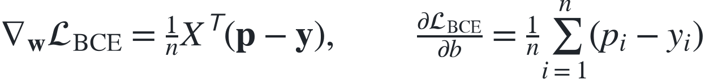

Compare this with the MSE gradient: we again multiply a vector of prediction errors by the input matrix. The output and loss have changed, but the pattern of learning is familiar.

The NumPy implementation reaches **89.3% test accuracy**, correctly classifying 134 of 150 students.

Why does it still struggle with the curve? At the classification boundary:

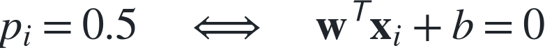

That is the equation of a straight line in our two-dimensional input space. The sigmoid is nonlinear, but its 0.5 threshold corresponds to a linear boundary. The notebook plots that boundary and explores how changing the probability threshold changes the errors.

## 3. The perceptron: a neuron with a hard decision

The perceptron makes the idea of an artificial neuron especially concrete: combine the inputs with weights, add a bias, and apply an activation.

Instead of a sigmoid, it uses a hard threshold. Using labels tᵢ ∈ {−1, +1}, its decision is:

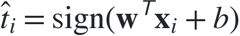

We take the sign at zero to be +1. When an example is misclassified or lies exactly on the boundary, the implementation applies the perceptron update:

The update pushes the prediction in the direction of that example's correct label. Unlike logistic regression, this rule does not rely on differentiating the output activation: the hard threshold has zero derivative away from its discontinuity, so ordinary backpropagation through it would provide no useful signal.

The classical perceptron convergence guarantee requires linearly separable training data. Our noisy, curved problem does not meet that condition. In the notebook, the number of errors oscillates rather than falling permanently to zero; the reference test accuracy is **87.3%**.

This step explains both what a neuron is and why the choice of activation matters. We will return to that choice when we build the network.

## 4. scikit-learn: verify that the mathematics survives the library

So far, we have written the learning rules ourselves. scikit-learn lets us fit the corresponding models through a common interface.

The theoretical objective remains the same. For example, unregularised logistic regression still seeks weights and a bias that minimise binary cross-entropy. A different solver can reach approximately the same solution without taking the same sequence of gradient steps.

That comparison is meaningful only when preprocessing and objectives agree. Regularisation adds a penalty to the loss, so it must be disabled when comparing a library fit with our unregularised NumPy implementation.

The notebook checks fitted coefficients numerically: the linear regression fits agree to numerical precision, and the logistic regression fits closely agree. Logistic regression again reaches **89.3% accuracy** on the same test set. Perceptron weights need not match, because example order and update details affect its solution on these nonseparable data.

The library now has an interpretable role: it supplies reliable implementations of models and objectives we already understand.

## 5. PyTorch: automate differentiation

With two weights and a bias, deriving gradients by hand is manageable. As models become compositions of many operations, we need a systematic way to differentiate them.

That way is the **chain rule**. For a parameter θ that affects a prediction through an intermediate quantity a:

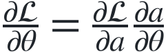

For a larger computation, we apply this rule along its dependencies and sum contributions where paths meet. PyTorch records the operations used to compute the loss and automatically works backwards to obtain parameter gradients. Backpropagation is this reverse calculation through the model; the optimiser then uses those gradients to update its parameters.

The model in this step is still a single affine layer. Combined with MSE, it performs linear regression; combined with a sigmoid and cross-entropy, it performs logistic regression. PyTorch's combined logits loss computes the latter objective stably without requiring an explicit sigmoid in the training model.

The practical notebook introduces mini-batches, which estimate a training gradient from subsets of examples. It reproduces the earlier fits, with logistic regression again reaching about **89.3% accuracy**. Automating differentiation makes the next step easier, while the model's representational limits remain visible.

## 6. A neural network: learn the features as well as the prediction

Our last model inserts a hidden layer between the inputs and the output:

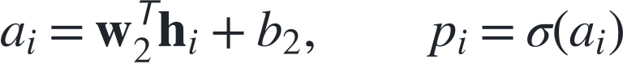

There are two inputs, 16 hidden units and one output. The network has **65 trainable parameters**: 32 input-to-hidden weights, 16 hidden biases, 16 output weights and one output bias.

The output still resembles logistic regression. What has changed is its input: it now receives 16 **learned features**, rather than the two features we originally supplied. Each hidden unit responds to a different weighted combination of study and sleep.

### Why the activation is essential

ReLU acts on each component separately:

It is continuous and piecewise linear, with derivative 1 for positive inputs and 0 for negative inputs. Its kink at zero does not prevent practical gradient-based training; automatic differentiation uses a defined convention there.

Without a nonlinear activation, two affine layers would collapse into one:

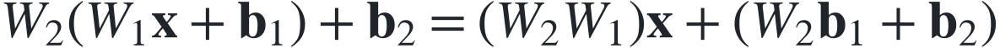

Extra layers alone would therefore leave a straight classification boundary. ReLU makes the hidden representation piecewise linear, allowing the boundary to bend as different hidden units become active.

We retain binary cross-entropy and differentiate it through both layers. This step also switches to Adam, an optimiser that uses running gradient statistics to adapt updates, and introduces early stopping: validation loss selects the checkpoint to retain. A lower training loss alone is not a reason to keep training indefinitely.

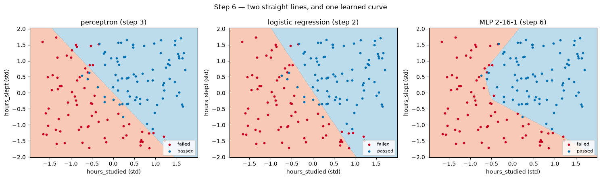

*The perceptron and logistic regression draw straight boundaries. The network learns a boundary that bends around the synthetic sleep effect. ReLU produces piecewise-linear regions rather than an exact smooth parabola.*

The network correctly classifies **143 of 150 test examples: 95.3% accuracy**, compared with 134 for logistic regression. The gain illustrates the value of a more expressive representation. It does not isolate architecture as the sole cause: the optimiser and stopping strategy also changed.

## One last comparison: do we need a neural network for this curve?

We know that the generating rule contains a squared sleep term. Suppose we give logistic regression that feature explicitly:

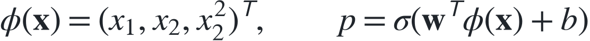

This model remains linear in its parameters, but its boundary can be nonlinear in the original inputs. Squaring standardised sleep is sufficient here: together with the linear sleep term and the intercept, it can represent a general quadratic in the original sleep variable.

The final notebook compares these approaches on the same test set:

| Classifier | Correct predictions | Test accuracy |
|---|---|---|
| Perceptron | 131 / 150 | 87.3% |
| Logistic regression | 134 / 150 | 89.3% |
| Logistic regression + squared sleep | 144 / 150 | 96.0% |
| Neural network, 2 → 16 → 1 | 143 / 150 | 95.3% |

The engineered feature is competitive with the network, using only four parameters. Its one-example advantage on this small test set is not evidence of general superiority. These results come from one fixed split and seeded training runs, with dependency versions recorded in the repository.

The comparison makes the role of representation concrete. We can design a useful feature when we understand the problem, or train a network to build useful features from the available inputs. The network gives us flexibility when the right transformation is harder to specify in advance.

## From equations to experiments

Across the six steps, the same structure persists: a parameterised function makes a prediction, a loss measures its error, and a learning rule adjusts the parameters. The progression to a neural network adds a learned intermediate representation and differentiates through it.

The [companion repository](https://github.com/clembnl/ai-learning-path) contains the seven notebooks, the synthetic dataset and the tested implementations. The [README](https://github.com/clembnl/ai-learning-path#download-and-run) explains how to download the project and launch JupyterLab with one command. A CPU is enough.

Start with notebook 00 and continue in order. At each step, connect an equation above to what the notebook computes: the residuals behind the MSE gradient, the straight line at a sigmoid probability of 0.5, or the hidden activations behind the network's curved boundary.

Then change one assumption and predict what will happen before running it. Increase the learning rate. Remove ReLU. Add the squared sleep feature. The equations tell you what to expect; the notebooks let you check your understanding.
